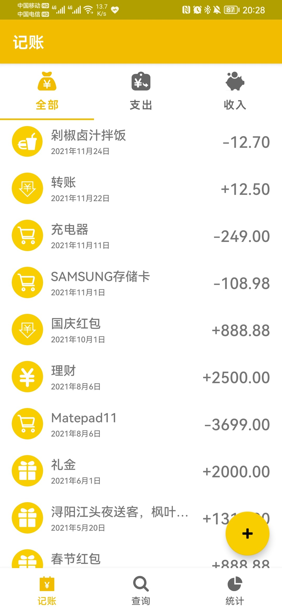
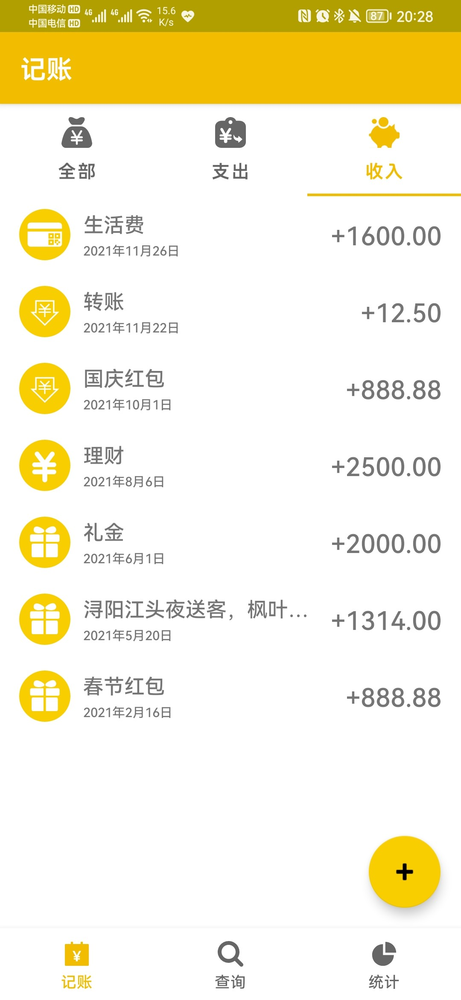
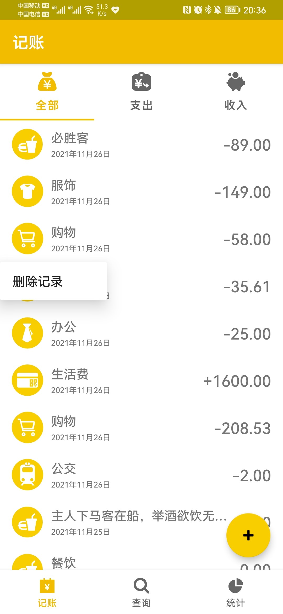
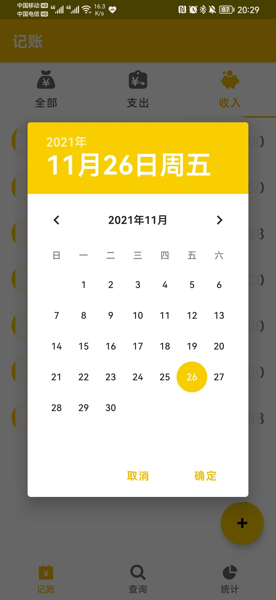
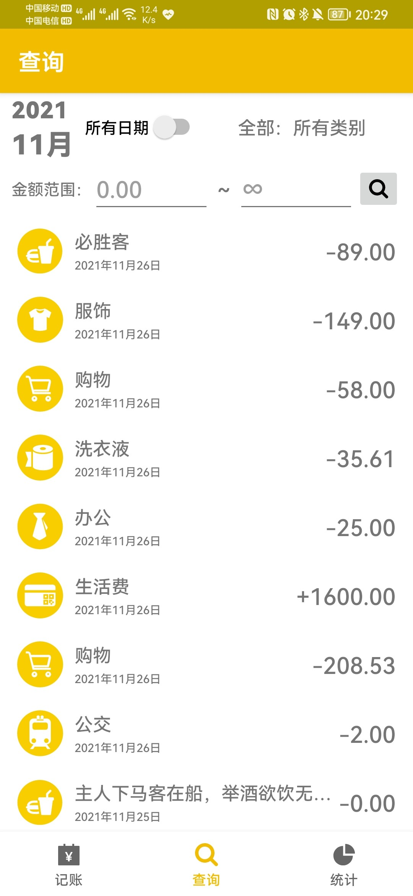
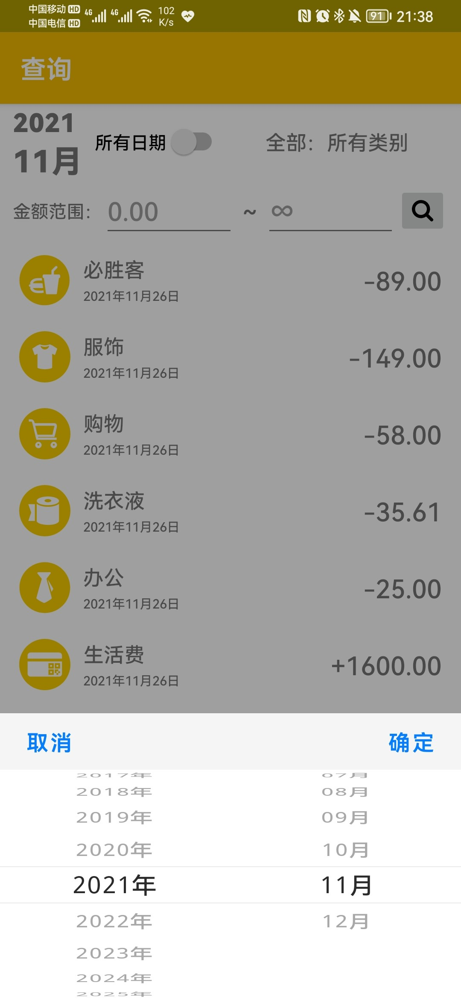
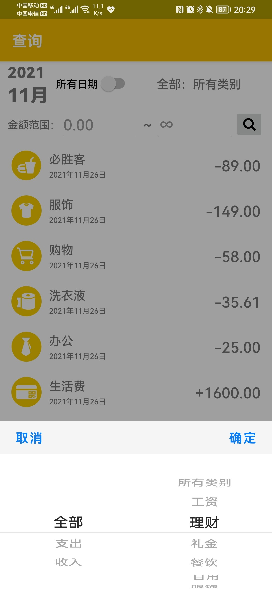
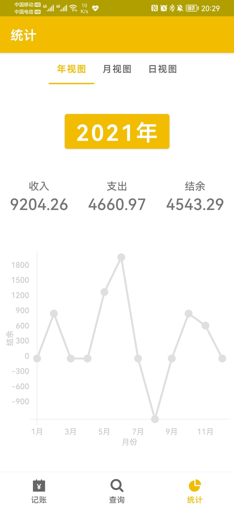
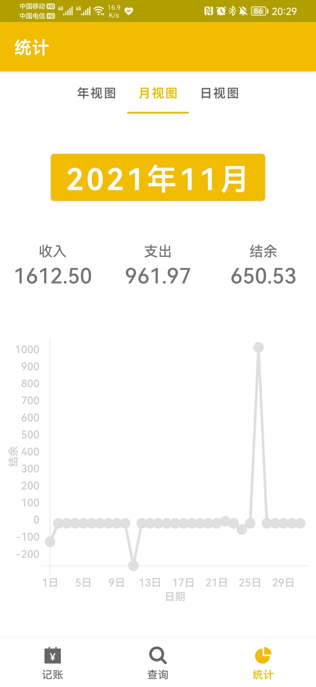
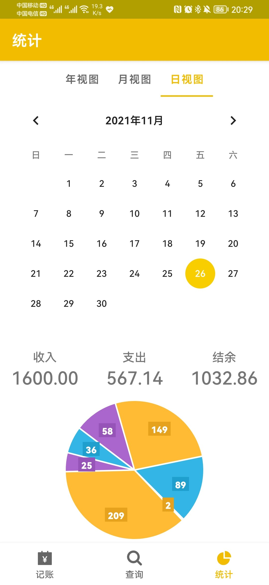

# Android-Application-AccountBook
重庆大学2019级计算机学院移动应用开发实验三：Android记账本

Android Studio Chipmunk | 2021.2.1 Patch 1

Gradle Version: 7.0.2

Compile Sdk Version: API 31(Android 12.0)

Dependency:

Android-PickerView:4.1.9

hellocharts-library:1.5.8@aar

#### 实验目的
1.	能够熟练的使用常用组件和布局进行界面设计。
2.	能够使用对话框、菜单、ViewPager、碎片等组件，并能使用RoomDB访问数据库数据。
3.	调试完成APP。

#### 实验内容
完成的软件基本功能包括：（1）分类记录日常收入和支出数据，包括金额、用途、日期、分类等信息；能够增加、删除等。（2）显示收支流水记录，显示当月、当日收支总额；（3）按周、月、年进行汇总形成结果。（4）具备友好的用户数据输入界面和查询界面。

#### 实验成果
应用主要由“记账”、“查询”和“统计”三个页面构成，通过底部BottomNavigationLayout按键切换。“记账”页罗列了数据库中已经记录的条目，展示了每条记录的类别、日期、金额等基本信息。上方的TabLayout可以切换条目种类，选择显示全部还是仅显示收入或支出。如果一条记录的有备注，则该条目标题显示其备注，若备注为空则显示类别。标题如果太长则以省略号结尾。

点击一个条目会以自定义对话框形式弹出该记录的详细信息，长按条目可以选择删除。

点击右下角的浮动按钮会弹出添加界面，可以选择收入或支出类别、日期，填写金额和备注，点击添加按钮就可以完成添加记录操作。金额填写框加入了限定规则，比如只能输入合法的小数，整数部分不能超过八位，小数部分最多两位。点击日期位置（默认今天）会弹出日历以供选择年月日。添加或删除条目后所有列表自动刷新。

底部第二页为查询页，上方为查询条件。点击年月会弹出年月选择框，选择后列表仅展示选中月份的条目。条目同样可以点击显示详情和长按选择删除。

点击所有日期开关会取消日期限定，展示所有日期的记录，同时左侧年月显示为“--”。右侧为类别筛选，点击会弹出一个联动选择器，可以筛选某一种类别。下方可以设置筛选的金额范围，输入最小值和最大值，点击搜索按钮进行筛选。

最后一个页面为统计，分为年、月、日三种视图。年视图可以点击选择一个年份，分别展示该年的收入、支出总和以及总结余，下方则是该年每月结余构成的折线图。月视图可以点击选择某年某月份，分别展示该月的收入、支出总和以及总结余，下方则是该月每天结余构成的折线图。日视图中可以在日历中选择一天，展示该日的收入、支出总和以及总结余，下方为各条支出构成的饼图。

本应用可以方便地完成记账和筛选查询工作，并通过图表直观地展现账目变化和开销组成。

#### 应用截图
-|-|-
:-------------------------:|:-------------------------:|:-------------------------:
 |  | 
 |  | 
 |  |
 |  |
 |  | 
